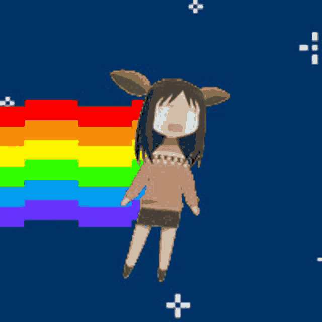

# Welcome to my Personal Digital Circus 🎪

<h2>
  
  I'm Julian (aka marstio),
</h2>

<h4>
A graduating CS student (Data Science track) based in the Philippines.
</h4>

I'm deeply passionate about computer science and building things that are visually clean and highly functional. My main toolkit for full-stack web development includes **React**, **TypeScript**, **Next.js**, and **Java**.

A major focus of my academic work is my senior thesis, where I apply **Random Forest** and **XGBoost** for spatial bias mitigation in Philippine urban-rural flood risk prediction. On the industry side, I recently completed an internship at Amdocs where I developed a centralized Server Environment Monitor for Korean Telecom.
 

<h3> Currently Working On:</h3>

- **Commit:** A developer-centric habit tracker and journal.
- **Angat Bayanihan:** Building frontend features for a grassroots volunteer microsite.
- **Steam NLP Analysis:** Developing a data science project analyzing Steam reviews to extract player sentiment, genre preferences, and gaming jargon.

You can check out my full portfolio and projects at <a href="https://www.julianramirez.site">julianramirez.site</a>.
 

<h3> Fun Facts:</h3>

- I'm a massive fan of story-driven and atmospheric games. You will usually find me playing titles like _Undertale_, _Until Then_, _Five Nights at Freddy's_, _Final Fantasy_, or _Detroit: Become Human_.
- You can occasionally find me on TikTok <a href="https://www.tiktok.com/@joolean">@joolean</a>.

 

  

